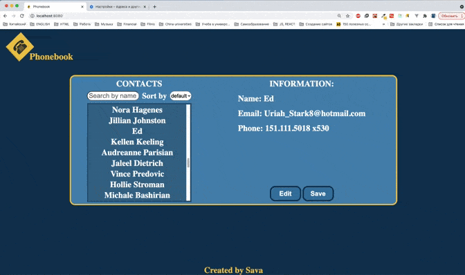
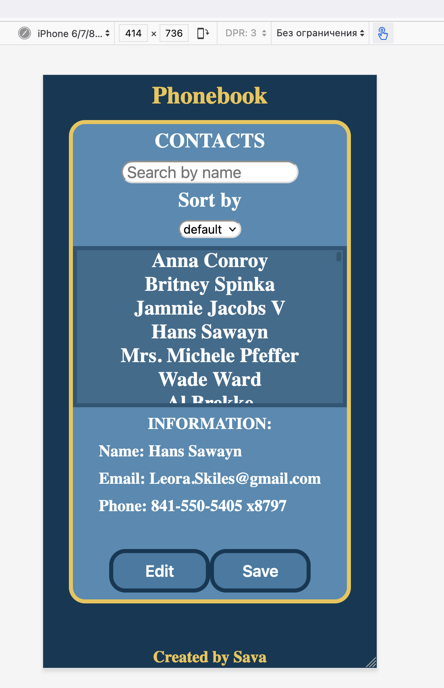
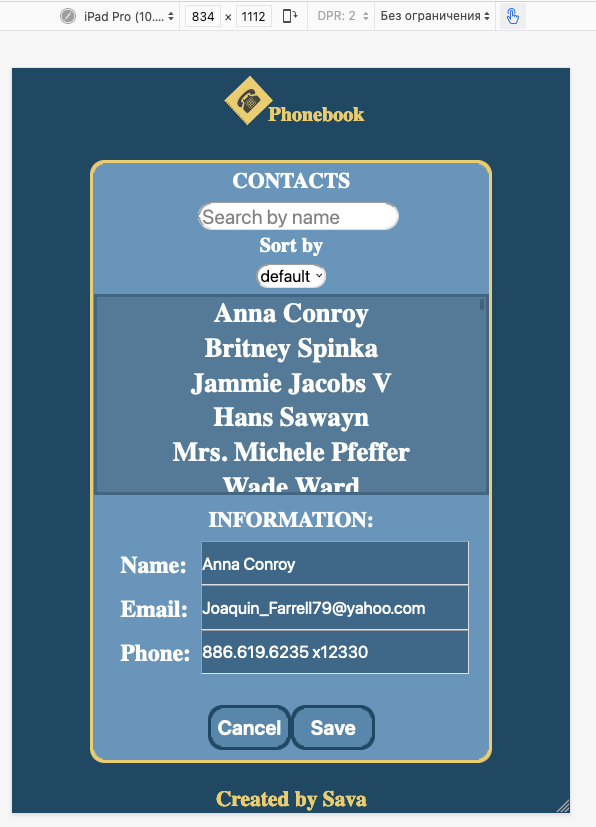

# Phonebook

### Desktop version:

This website created for desktop, mobile and tablet. You can see mobile and tablet down below

## INSTALLATION:

### `npm install`

## RUN SERVER

### `npm start`

## DEPENDENCIES

    "react": "^17.0.2",
    "react-dom": "^17.0.2",
    "react-redux": "^7.2.4",
    "redux": "^4.1.0",
    "redux-persist": "^6.0.0",
    "redux-saga": "^1.1.3",
    "uuid": "^3.4.0"

### I've used this API: https://api.giphy.com

### Mobile version:

### Tablet version:

